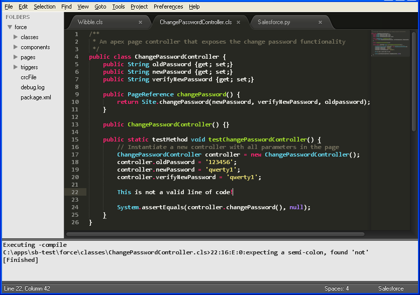

# IDE

The Stuntbyte "IDE" allows developers to use quality editors like Sublime Text 2 and VIM when developing Apex Code. This is useful because Salesforce's "Force.com IDE" is currently quite limited.

Here's what Sublime Text 2 looks like:



These Editors:

*   Support compilation, error reporting, and, unlike "Force.com IDE", easy access to the line of code that caused an error -- simply click on the error message and go to the right line, in the right file!
*   Make the debug log easy to access and search. No more fiddly copy and pasting.
*   Have easy code navigation. Drill down into classes and method calls, and pop back up again.
*   Include limited auto-completion.
*   Are fast!
*   Are nicely extensible.

## Limitations

The 'IDE' extensions don't do everything:

1.  There is no support for creation of new files from within the editor. In practice this isn't a big deal, and if people shout we'll be happy to add it :-)
2.  File deletion isn't integrated into the editors. You'll just be deleting the file from the local file system. Given the lack of version control in Salesforce, this is currently considered to be a good thing, and we have deliberately not wired it up. Our "backend" does support file deletion, so if you are brave you are welcome to add it.
3.  Controlling debugging levels [via the API](http://www.salesforce.com/us/developer/docs/apexcode/Content/sforce_api_header_debuggingheader.htm) simply doesn't seem to work. If anybody from Salesforce can help, we'd be glad to hear from you!


# Sublime Text 2

Installation and setup is a little clunky in Sublime Text 2\. Hopefully this can be improved as the editor matures. We really need an api call to allow us access to the current project file (hint, hint).

This installation includes a number of "snippets", so you can quickly construct common blocks of code, but these snippets have simply been quickly copied from the Sublime's Java support, and include no Salesforce-specific features. If anybody is keen on extending these, we'd be happy to update the package!

We have begun the process of making this code available on Github as part of https://github.com/SublimeText

*   Install [Java](http://www.java.com/) and ensure it's on your path.
*   Install [Exuberant ctags](http://ctags.sourceforge.net/) and ensure it's on your path;
 ```sudo apt-get install ctags```
*   Install [Sublime Text 2](http://www.sublimetext.com/2)
*   Start Sublime Text 2
*   Select menu item "Preferences : Settings - User" and add a setting that defines the location of the Stuntbyte all-purpose "jdbc" jar file you downloaded from the [download page](/download). Save the change. eg:

stuntbyte_jar": "/apps/stuntbyte/stuntbyte-sfdc-1.4.jar"

*   Download the "[editors.zip](/downloads/editors.zip)" and unzip it.
*   Put the Packages directory (/sublime2/Packages in editors.zip) under
  *   ~/.config/sublime-text-2 (Linux) or
  *   "%APPDATA%/Sublime Text 2" (Windows) or
  *   "~/Library/Application Support/Sublime Text 2" (Mac OS)

*   Install ctags support into Sublime Text, per instructions at [https://github.com/SublimeText/CTags](https://github.com/SublimeText/CTags). eg:

```
cd ~/.config/sublime-text-2/Packages/ (Linux)
cd "%APPDATA%/Sublime Text 2/Packages" (Windows)
cd "~/Library/Application Support/Sublime Text 2/Packages" (Mac OS)
git clone https://github.com/SublimeText/CTags (or download the zip; https://github.com/SublimeText/CTags/zipball/master)
```

*   Copy sample.sublime-project and ide.properties (from /sublime in editors.zip) into another folder, eg "/tmp/projects"
*   Edit sample.sublime-project and point "ide.properties" at the file, using an absolute pathname. eg: /tmp/projects/ide.properties
*   Edit ide.properties and define the sf host, username and password (ie: security token + password) for your development environment.
*   Open the sample project file in Sublime, using the Projects menu.
*   Download Salesforce code, using the Projects Menu: Salesforce Download All.
*   Refresh the folder view, using the Projects Menu: Refresh Folders.
*   Generate tags: from Projects Menu: Salesforce Retag. You must be viewing an Apex class or Trigger for this to work correctly.
*   Navigate classes with CTRL-P (and start typing)
*   Navigate symbols within a class with CTRL-R
*   Drill into methods or classes with CTRL-ALT-]
*   Pop back with CTRL-ALT-[
*   Compile a class with F7\. If the class name ends in "Test" or "Tests" then we also execute the tests. If errors occur, navigate to offending lines by clicking on the error message.
*   View the automatically generated debug.log file to see details of the test run

# VIM INSTALLATION

[VIM](http://www.vim.org/) is one of the world's great text editors, and now you can use it when developing Salesforce code. It does have a steep learning curve, but it's worth the effort.

Here's how to set it up:

*   Install [Java](http://www.java.com/) and ensure it's on your path.
*   Install [Exuberant ctags](http://ctags.sourceforge.net/) and ensure it's on your path; ```sudo apt-get install ctags```
*   Install [VIM](http://www.vim.org/)
*   Download the Stuntbyte all-purpose "jdbc" jar file from the [download page](download.html).
*   Download the Stuntbyte "[editors.zip](/downloads/editors.zip)" and unzip it.
*   Edit "stuntbyte.vim" (from /vim in editors.zip) and ensure that the "runIde" line refers to the location of the stuntbyte jar file on your system.
*   Edit ide.properties (from /vim in editors.zip) and define the sf host, username and password (ie: security token + password) for your development environment.
*   Start the "ide" using: vim -S stuntbyte.vim
*   Download all source code using ",da" in edit mode
*   Tag the source code using ",tag" in edit mode
*   Navigate source using standard tag commands, eg: :tag <classname> and CTRL-] (You really should read :help tags)
*   Compile a class with F7\. If the class name ends in "Test" or "Tests" then we also execute the tests. If errors occur, navigate to offending lines by clicking on the error message.
*   Use F3 to view the automatically generated debug.log file, and see details of the test run

The full list of supported commands is as follows:

| Command | Purpose |
|---------|---------|
| F2 | 'Drill down' to the current token, splitting the window on the way |
| F4 | Make the debug log easier to read |
| F7 | Save the current file to Salesforce. Runs tests if it's a test class |
| F9 | Disable a test method (must be on the 'testMethod' declaration) |
| F10 | Enable a test method (must be on the 'testMethod' declaration) |
| F11 | Disable all test methods |
| F12 | Enable all test methods |
| ,d | Download the latest version of the currently edited file |
| ,da | Download the latest version of all files |
| ,uf | Force a save (upload) of the current file, even though it is out of sync with the version on the server |
| ,tag | Retag the source |

# Command Line

Behind the scenes, the "IDE" is actually a command line Java application that pushes Salesforce code to and from a Salesforce server. You should be able to wire it up to editors other than Sublime Text 2 and VIM, as long as the editor understands ctags, and allows a hook in to a "build system" that generates "AztecC.Err" error messages.

If you run it from a command line you can see the supported arguments and parameters.

```java -cp stuntbyte-sfdc-1.4.jar com.stuntbyte.salesforce.ide.SalesfarceIDE```

Supported arguments:

*   **-compile**. upload and compile/test file
*   **-force**. upload and compile/test file, regardless of crc failure
*   **-downloadall**. download 'everything'
*   **-download**. download just this file
*   **-delete**. delete this file
*   **-runtests**. run all tests for downloaded code
*   **-tag**. regenerate tags

It writes error messages to stdout in the "AztecC.Err" format, "%f>%l:%c:%t:%n:%m". Note the literal ">" and ":" characters, and:

*   %f file name of the error
*   %l line number of the error
*   %c column number of the error
*   %t error type (E)rror, or (W)arning
*   %n error number. Always "0"
*   %m error message.