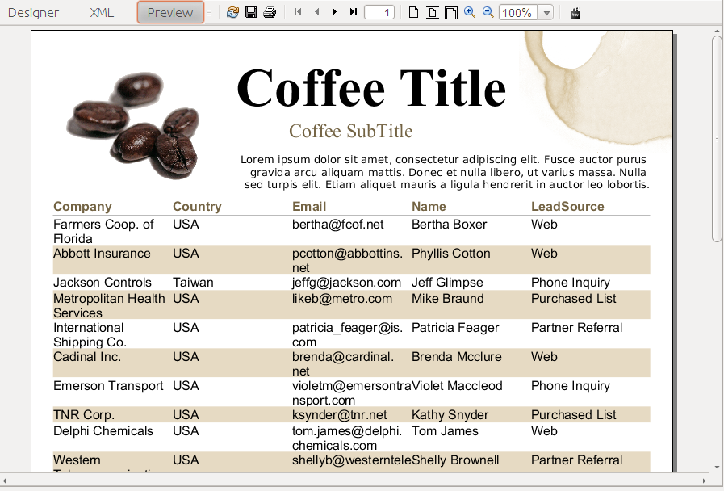
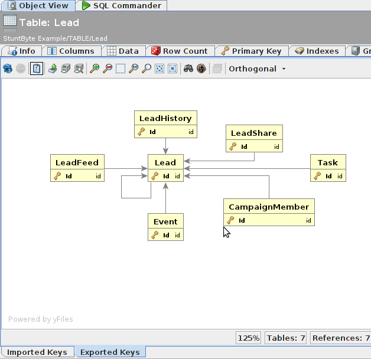
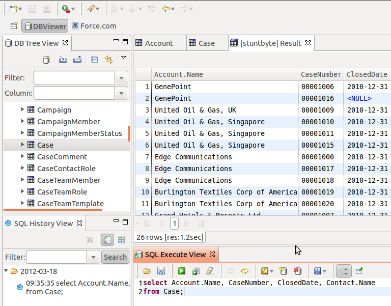

# JDBC Introduction

The JDBC driver allows users to browse and update Salesforce databases using some of the best database tools, such as:

*   [DBVisualizer](http://www.dbvis.com/)
*   [Execute Query](http://executequery.org/)
*   [SQL Workbench/J](http://www.sql-workbench.net/)
*   [SQuirrel SQL](http://www.squirrelsql.org/)
*   [Jasper Reports](http://jasperforge.org/projects/jasperreports)
*   [Mogwai ER Designer NG](http://mogwai.sourceforge.net/erdesignerng.html)
*   [DBViewer](http://www.ne.jp/asahi/zigen/home/plugin/dbviewer/about_en.html) (Eclipse plugin -- ideal for use with the Force IDE)

It also exposes useful information about Salesforce objects via the JDBC meta data api, so tools like SQL-Workbench make it really easy to learn more about your objects without having to click through lots of web pages in Salesforce. Take note of the "Remarks" column for this sample table:


You can produce PDF reports using [Jasper Reports iReport](http://jasperforge.org/projects/ireport) (hot tip: Register the Stuntbyte driver on the "Services" window):



Tools like [DbVisualizer](http://www.dbvis.com/), and especially [Execute Query](http://executequery.org) make it easier to understand the relationships between your objects.



The JDBC Driver integrates with Eclipse, so you can use it from within the Force IDE if you use that tool as your development platform.



The JDBC driver does NOT turn Salesforce into a fully compliant SQL database. In particular, it does NOT add support for arbitrary joins, but it does offer the following enhancements to Salesforce SOQL:

### UPDATE

The SQL UPDATE, including the ability to refer to other columns. eg:

```
UPDATE Lead SET FirstName = LastName, LastName = FirstName
WHERE FirstName = 'Smith'
```

### DELETE

The SQL DELETE command. eg:

```
DELETE FROM Lead WHERE FirstName = 'Smith'
```

### SELECT *

This is worth the price of admission alone.

```
SELECT * FROM Lead
```

### SELECT with column aliases:

```
SELECT FirstName as fn, LastName as ln, CreatedDate, CreatedBy.name as cn
FROM Lead
```

### SELECT COUNT(*)

```
SELECT COUNT(*) FROM Lead
```
